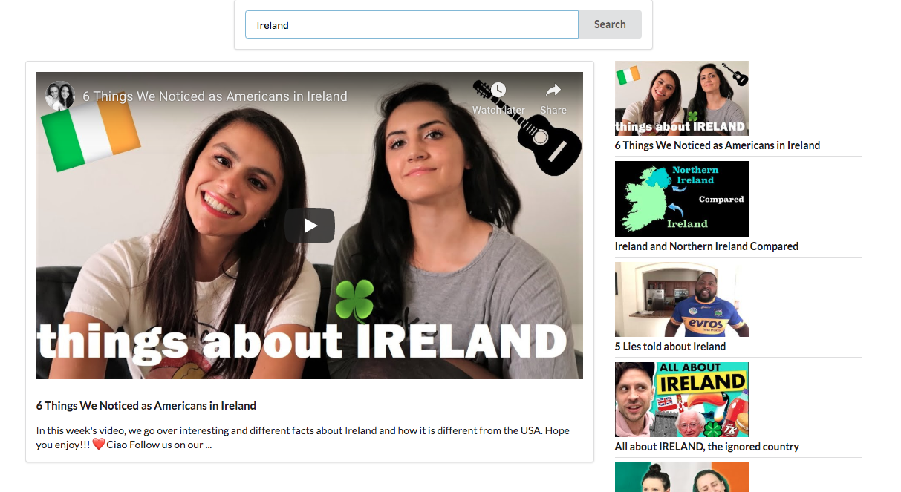

This project was bootstrapped with [Create React App](https://github.com/facebook/create-react-app).

This webapp uses the Youtube Search API to retrieve videos based on an input query from the user. This webapp uses multiple react components, props, state, semantic-ui, some basic Sass and axios to make api calls.

  

